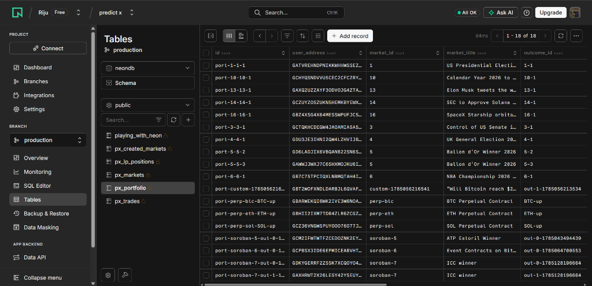
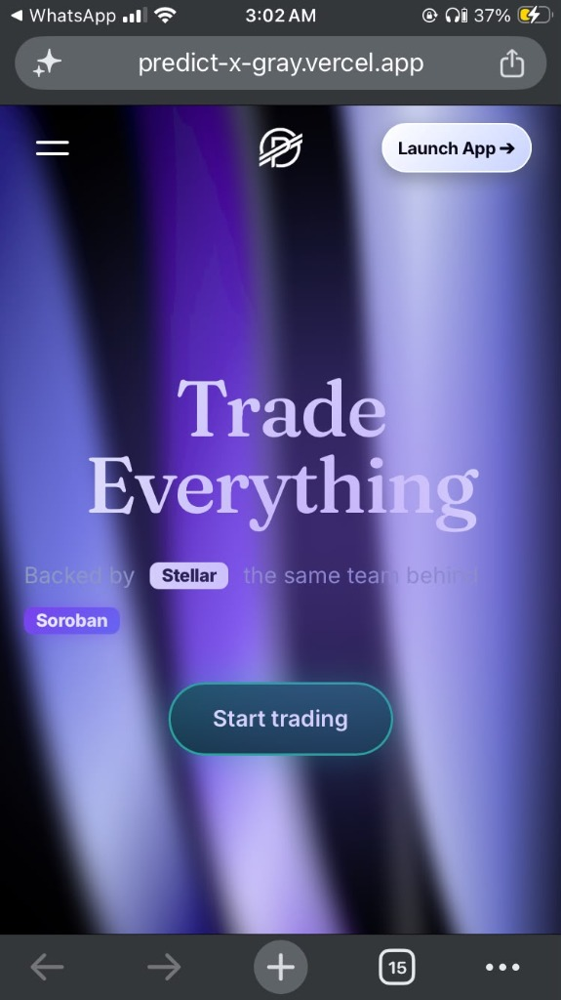

<div align="center">


<br/>
<br/>

```
██████╗ ██████╗ ███████╗██████╗ ██╗ ██████╗████████╗    ██╗  ██╗
██╔══██╗██╔══██╗██╔════╝██╔══██╗██║██╔════╝╚══██╔══╝    ╚██╗██╔╝
██████╔╝██████╔╝█████╗  ██║  ██║██║██║        ██║        ╚███╔╝
██╔═══╝ ██╔══██╗██╔══╝  ██║  ██║██║██║        ██║        ██╔██╗
██║     ██║  ██║███████╗██████╔╝██║╚██████╗   ██║       ██╔╝ ██╗
╚═╝     ╚═╝  ╚═╝╚══════╝╚═════╝ ╚═╝ ╚═════╝   ╚═╝       ╚═╝  ╚═╝
```

### 🔮 Decentralized Prediction Market Protocol on Stellar Soroban

**Trade YES/NO outcome shares · Provide AMM liquidity · Earn protocol fees · Everything on-chain**

[🌐 Live App](https://predict-x-gray.vercel.app/app) · [📋 Feedback Form](https://forms.gle/SyWZnynTtpWFPG7j8) · [🔍 StellarExpert (Testnet)](https://stellar.expert/explorer/testnet) · [📄 PPT](https://predictx-presentation.vercel.app/) · [🚀 DEMO VIDEO](https://youtu.be/I1hi_T5dujE?si=pOnHJtqk1yaiJnKa)
[📄 FEEDBACK SHEET](https://docs.google.com/spreadsheets/d/1BEMWSMzzhpb87IglygYy2K7EfSFIu_AuMIC2cH_ghGw/edit?resourcekey=&gid=60851251#gid=60851251)

</div>

---

## 📖 Project Overview

**PredictX** is a fully decentralized, production-grade prediction market protocol built natively on [Stellar Soroban](https://soroban.stellar.org/). It enables anyone to create binary or multi-outcome prediction markets on real-world events — sports, crypto prices, elections, and more — and trade outcome shares using a constant-product AMM (Automated Market Maker) with on-chain liquidity pools.

Every trade, sell, market creation, and liquidity deposit is a **real Soroban smart contract transaction** signed by the user's Freighter wallet and confirmed on Stellar Testnet. No centralized backend, no mock data — the blockchain is the single source of truth.

> 💡 **Built for the Stellar Ecosystem** — PredictX showcases the full power of Soroban's composable smart contract architecture: factory patterns, token standards, AMM math, oracle resolution, and multi-contract interactions all wired together in a single cohesive protocol.

---

## ✨ Features

| Feature | Status | Description |
|---|---|---|
| 🏪 **Market Creation** | ✅ Live | Deploy binary/multi-outcome markets via Soroban Factory Contract |
| 📈 **Buy Shares** | ✅ Live | Purchase YES/NO outcome shares using AMM constant-product pricing |
| 📉 **Sell Shares** | ✅ Live | Sell partial or full positions back to AMM pool with real-time payout quotes |
| 💧 **LP Liquidity** | ✅ Live | Add/Remove XLM liquidity to market pools and earn 50% of trading fees |
| 🏆 **Claim Winnings** | ✅ Live | Claim XLM payouts from resolved markets |
| 🔐 **Freighter Wallet** | ✅ Live | Full wallet connect / sign / disconnect integration |
| 🚰 **Token Minting** | ✅ Live | Mint 1,000 testnet XLM tokens via Soroban Token Contract |
| 📊 **Live Charts** | ✅ Live | Real-time probability price charts with multi-series candlestick view |
| ⚡ **Perps Terminal** | ✅ Live | Leveraged perpetual contracts on crypto price feeds |
| 🌐 **Live Feed** | ✅ Live | Real-time event discovery feed |
| 📁 **Portfolio Tracker** | ✅ Live | Persistent portfolio, trade history, and created markets per wallet |
| 🔗 **StellarExpert Links** | ✅ Live | Every transaction links directly to the Stellar blockchain explorer |

---

## 🏗️ Architecture

```
┌─────────────────────────────────────────────────────────────────────┐
│                        PredictX Architecture                        │
└─────────────────────────────────────────────────────────────────────┘

  ┌──────────────────────────────────────────────┐
  │              Next.js 16 Frontend             │
  │  ┌─────────────┐  ┌──────────────────────┐  │
  │  │ TradingDrawer│  │  SellSharesModal     │  │
  │  │  BUY / SELL  │  │  Preset Sell UX      │  │
  │  └─────────────┘  └──────────────────────┘  │
  │  ┌─────────────┐  ┌──────────────────────┐  │
  │  │ MarketFeed  │  │  PerpsTerminal       │  │
  │  └─────────────┘  └──────────────────────┘  │
  │  ┌─────────────┐  ┌──────────────────────┐  │
  │  │ WalletModal │  │  Portfolio Tracker   │  │
  │  └─────────────┘  └──────────────────────┘  │
  └──────────────┬───────────────────────────────┘
                 │  Stellar SDK + Freighter API
                 ▼
  ┌──────────────────────────────────────────────┐
  │          Soroban RPC (Testnet)               │
  │  simulate_transaction → signAndSend          │
  └──────────┬───────────────────────────────────┘
             │
  ┌──────────▼───────────────────────────────────────────────────────┐
  │                   Stellar Soroban Smart Contracts                 │
  │                                                                   │
  │  ┌──────────────────┐    ┌─────────────────────────────────────┐ │
  │  │  Market Factory  │───▶│  Market Contract (AMM Core)         │ │
  │  │  create_market() │    │  buy_shares()  sell_shares()        │ │
  │  └──────────────────┘    │  add_liquidity() remove_liquidity() │ │
  │                          │  claim_winnings() get_balance()     │ │
  │  ┌──────────────────┐    │  resolve_market() lock_market()     │ │
  │  │   Oracle         │───▶│  get_market_state()                 │ │
  │  │  resolve_market()│    └─────────────────────────────────────┘ │
  │  └──────────────────┘                                             │
  │  ┌──────────────────┐    ┌─────────────────────────────────────┐ │
  │  │  Token Contract  │    │  AMM Contract                       │ │
  │  │  mint() transfer │    │  Constant Product x·y = k           │ │
  │  └──────────────────┘    └─────────────────────────────────────┘ │
  └──────────────────────────────────────────────────────────────────┘
             │
  ┌──────────▼───────────────────────────────────┐
  │          Persistent Local Storage (db.ts)    │
  │  Portfolio · Trade History · Created Markets │
  └──────────────────────────────────────────────┘
```

### Contract Interaction Flow

```
User → Freighter Wallet Sign → Soroban RPC simulate_transaction
     ↓ [if simulation passes]
     → signAndSend → Stellar Testnet Ledger → On-Chain State Update
     ↓
     → Read res.result (actual shares_out) → Update Local Portfolio
     → Emit StellarExpert Transaction Link
```

---

## 🛠️ Technology Stack

### Smart Contract Layer
| Technology | Version | Role |
|---|---|---|
| **Rust** | Stable | Smart contract implementation language |
| **Soroban SDK** | `27` | Stellar smart contract framework |
| **`#![no_std]`** | — | WASM-optimized contracts with zero stdlib |
| **Stellar CLI** | Latest | Contract deployment & invocation |

### Frontend Layer
| Technology | Version | Role |
|---|---|---|
| **Next.js** | `16.2.10` (Turbopack) | Full-stack React framework |
| **React** | `19.2.4` | UI component library |
| **TypeScript** | `^5` | Type-safe frontend development |
| **`@stellar/stellar-sdk`** | `^16.0.1` | Soroban RPC client & transaction builder |
| **`@stellar/freighter-api`** | `^6.0.1` | Browser wallet integration |
| **Recharts** | `^3.9.2` | Probability price chart rendering |
| **Lightweight Charts** | `^5.2.0` | Perps candlestick terminal |
| **Framer Motion** | `^12.42.2` | UI micro-animations |
| **Lenis** | `^1.3.25` | Smooth scroll engine |

---

## 🔄 System Workflow

### Buy Shares Workflow
```
1. User selects market + outcome (YES / NO)
2. User enters XLM amount in TradingDrawer
3. Frontend calls: marketClient.buy_shares({ user, market_id, outcome, payment })
4. Soroban simulates transaction (pre-flight check)
5. Freighter wallet opens → user approves
6. Transaction broadcasts to Stellar Testnet ledger
7. Contract executes AMM:
     fee = payment × protocol_fee_bps / 10000
     net_payment = payment - fee - creator_fee
     shares_out = yes_reserves × net_payment / (no_reserves + net_payment)
8. Contract credits UserYesBalance(user, market_id) += shares_out
9. Frontend reads res.result → stores ACTUAL shares_out in portfolio
10. StellarExpert tx link displayed
```

### Sell Shares Workflow
```
1. User clicks "Sell Shares" from Portfolio tab
2. SellSharesModal opens with preset options (25% / 50% / 75% / MAX)
3. Live AMM payout quote computed (gross payout - 1% fee)
4. Frontend calls: marketClient.get_balance(user, market_id, outcome)
      → reads ACTUAL on-chain balance before simulation
5. Sell amount capped to on-chain balance (prevents contract panic)
6. Frontend calls: marketClient.sell_shares({ user, market_id, outcome, rawShares })
7. Freighter wallet opens → user approves
8. Contract executes reverse AMM:
     collateral_out = no_reserves × shares / (yes_reserves + shares)
9. XLM transferred back to user wallet
10. Portfolio state updated atomically
```

### Market Creation Workflow
```
1. Creator fills out CreateMarketModal (title, outcomes, end date, liquidity)
2. Frontend calls: factoryClient.create_market({ creator, question, resolution_time, oracle_id })
3. Factory contract deploys new Market instance with:
     - Initial YES / NO reserves (1,000,000,000 raw = 100 tokens each)
     - Protocol fee: 1% | Creator fee: 0.5%
4. Creator LP position recorded on-chain
5. Market appears in feed immediately
```

### Fee Distribution
```
1% Total Fee per Trade:
  ├── 50% → LP Pool (distributed to liquidity providers)
  ├── 30% → Market Creator
  └── 20% → Protocol Treasury
```

---

## 📜 Smart Contracts

### Market Contract (`contracts/market`)
The core AMM and market state machine.

**Public Functions:**
| Function | Description |
|---|---|
| `initialize(admin, token, factory, treasury)` | One-time contract setup |
| `create_market(creator, market_id, resolution_time, oracle_id)` | Creates a new market with initial reserves |
| `buy_shares(user, market_id, outcome, payment) → i128` | Buy YES/NO shares with constant-product AMM |
| `sell_shares(user, market_id, outcome, shares) → i128` | Sell shares back to AMM pool |
| `add_liquidity(user, market_id, amount) → i128` | Deposit XLM into pool |
| `remove_liquidity(user, market_id, amount) → i128` | Withdraw XLM from pool |
| `claim_winnings(user, market_id) → i128` | Claim payout on resolved market |
| `resolve_market(market_id, outcome)` | Oracle-signed market resolution |
| `lock_market(market_id)` | Lock after resolution timestamp |
| `get_balance(user, market_id, outcome) → i128` | Read on-chain share balance |
| `get_market_state(market_id) → MarketState` | Read full market state |

**AMM Pricing Formula (Constant Product):**
```
x · y = k

Buy YES:  shares_out = yes_reserves × payment / (no_reserves + payment)
Buy NO:   shares_out = no_reserves × payment / (yes_reserves + payment)

Sell YES: collateral = no_reserves × shares / (yes_reserves + shares)
Sell NO:  collateral = yes_reserves × shares / (no_reserves + shares)
```

### Market Factory Contract (`contracts/market_factory`)
Deploys and registers new market instances via `create_market()`.

### Oracle Contract (`contracts/oracle`)
Trusted oracle that calls `resolve_market()` to set the winning outcome.

### AMM Contract (`contracts/amm`)
Standalone AMM module for advanced liquidity calculations.

### Token Contract
Soroban-native token contract (SEP-41 compatible) for testnet XLM minting.

---

## 🚀 Installation

### Prerequisites
- **Node.js** ≥ 18
- **Rust** + `wasm32-unknown-unknown` target
- **Stellar CLI** (`cargo install --locked stellar-cli --features opt`)
- **Freighter Browser Extension** (Chrome/Firefox)

### Clone & Setup

```bash
# Clone the repository
git clone https://github.com/Riju79/predict-x.git
cd predict-x

# Install frontend dependencies
cd predict-x
npm install

# Build Soroban contracts
cd ..
cargo build --target wasm32-unknown-unknown --release
```

### Run Development Server

```bash
cd predict-x
npm run dev
```

Open [http://localhost:3000/app](http://localhost:3000/app)

### Build for Production

```bash
cd predict-x
npm run build
npm start
```

---

## 🔐 Environment Variables

Create `predict-x/.env.local`:

```env
# Stellar Network
NEXT_PUBLIC_STELLAR_NETWORK=testnet
NEXT_PUBLIC_SOROBAN_RPC_URL=https://soroban-testnet.stellar.org

# Contract Addresses (Soroban Testnet)
NEXT_PUBLIC_MARKET_CONTRACT_ID=CAP5UKEGIW2SIUQIFR6VQ7665EHAJ4E47ORTFW52VRKBSZQYP47UFTRM
NEXT_PUBLIC_FACTORY_CONTRACT_ID=CAH7OM5SZSFF5NJO7IMLLVI2TJKZMIE5E7ZLSILMKAMWVFMCENDKKFYQ
NEXT_PUBLIC_TOKEN_CONTRACT_ID=CDLZFC3SYJYDZT7K67VZ75HPJVIEUVNIXF47ZG2FB2RMQQVU2HHGCYSC
NEXT_PUBLIC_ORACLE_CONTRACT_ID=CBVFQ4A4J7U2X6ZZBJE6MN5L2DJG4M7VBIG3MXV2XH4KQ2UNMNEGIGR5
NEXT_PUBLIC_AMM_CONTRACT_ID=CCWT35G2TPYBPDIHD5A4HKY2VOORJ55JPV4YEPJRAKKJZCP7F5LOZASS
```

---

## 📦 Deployment Guide

### Deploy Soroban Contracts to Testnet

```bash
# Fund deployer account on testnet
stellar keys generate --global deployer --network testnet
stellar keys fund deployer --network testnet

# Build optimized WASM
cargo build --target wasm32-unknown-unknown --release

# Deploy Token Contract
stellar contract deploy \
  --wasm target/wasm32-unknown-unknown/release/token.wasm \
  --source deployer \
  --network testnet

# Deploy Market Contract
stellar contract deploy \
  --wasm target/wasm32-unknown-unknown/release/market.wasm \
  --source deployer \
  --network testnet

# Deploy Factory Contract
stellar contract deploy \
  --wasm target/wasm32-unknown-unknown/release/market_factory.wasm \
  --source deployer \
  --network testnet

# Initialize Market Contract
stellar contract invoke \
  --id <MARKET_CONTRACT_ID> \
  --source deployer \
  --network testnet \
  -- initialize \
  --admin <ADMIN_ADDRESS> \
  --token <TOKEN_CONTRACT_ID> \
  --factory <FACTORY_CONTRACT_ID> \
  --treasury <TREASURY_ADDRESS>
```

### Generate TypeScript Bindings

```bash
# Generate client bindings for Market contract
stellar contract bindings typescript \
  --contract-id <MARKET_CONTRACT_ID> \
  --network testnet \
  --output-dir predict-x/src/bindings/market

# Generate client bindings for Factory contract
stellar contract bindings typescript \
  --contract-id <FACTORY_CONTRACT_ID> \
  --network testnet \
  --output-dir predict-x/src/bindings/market_factory
```

---

## 📍 Contract Addresses (Stellar Testnet)

| Contract | Address | Explorer |
|---|---|---|
| **Market (AMM Core)** | `CAP5UKEGIW2SIUQIFR6VQ7665EHAJ4E47ORTFW52VRKBSZQYP47UFTRM` | [View ↗](https://stellar.expert/explorer/testnet/contract/CAP5UKEGIW2SIUQIFR6VQ7665EHAJ4E47ORTFW52VRKBSZQYP47UFTRM) |
| **Market Factory** | `CAH7OM5SZSFF5NJO7IMLLVI2TJKZMIE5E7ZLSILMKAMWVFMCENDKKFYQ` | [View ↗](https://stellar.expert/explorer/testnet/contract/CAH7OM5SZSFF5NJO7IMLLVI2TJKZMIE5E7ZLSILMKAMWVFMCENDKKFYQ) |
| **Oracle** | `CBVFQ4A4J7U2X6ZZBJE6MN5L2DJG4M7VBIG3MXV2XH4KQ2UNMNEGIGR5` | [View ↗](https://stellar.expert/explorer/testnet/contract/CBVFQ4A4J7U2X6ZZBJE6MN5L2DJG4M7VBIG3MXV2XH4KQ2UNMNEGIGR5) |
| **AMM** | `CCWT35G2TPYBPDIHD5A4HKY2VOORJ55JPV4YEPJRAKKJZCP7F5LOZASS` | [View ↗](https://stellar.expert/explorer/testnet/contract/CCWT35G2TPYBPDIHD5A4HKY2VOORJ55JPV4YEPJRAKKJZCP7F5LOZASS) |
| **Token (XLM)** | `CDLZFC3SYJYDZT7K67VZ75HPJVIEUVNIXF47ZG2FB2RMQQVU2HHGCYSC` | [View ↗](https://stellar.expert/explorer/testnet/contract/CDLZFC3SYJYDZT7K67VZ75HPJVIEUVNIXF47ZG2FB2RMQQVU2HHGCYSC) |

---

## 📸 Screenshots & Architecture Visuals

> *Connect your Freighter wallet, mint testnet XLM, trade perps, view on-chain Neon database analytics, and trade seamlessly on mobile!*

| 📊 Data Analytics (Neon Postgres DB) | 📱 Mobile Responsive UI |
|:---:|:---:|
|  |  |
| **Real-time On-Chain Indexer**: Neon PostgreSQL tables (`px_portfolio`, `px_trades`, `px_markets`, `px_created_markets`, `px_lp_positions`) | **Mobile Responsive Interface**: Full mobile navbar, drawer, adaptive cards & mobile wallet guidance |

<br/>

| Landing page | Trading Interface | Market Detail |
|:---:|:---:|:---:|
|  | 
 |  |

---

## 🎥 Demo Video

> 📽️ **[Watch Full Demo →](https://youtu.be/I1hi_T5dujE?si=pOnHJtqk1yaiJnKa)** — See PredictX in action: wallet connect, market creation, buying/selling shares, and on-chain transaction confirmation.

---

## 🔄 User Feedback Changes & Git Commits

> 🌐 **Live Application**: [https://predict-x-gray.vercel.app/app](https://predict-x-gray.vercel.app/app)  
> 🧪 **Live Feedback Deployment**: [https://predict-fip0qirtm-rijurj84kly-beeps-projects.vercel.app/](https://predict-fip0qirtm-rijurj84kly-beeps-projects.vercel.app/)

The following recent commits address user feedback iterations across database persistence, mobile UI responsiveness, and mobile wallet integration:

| Commit | Description / Feedback Resolved |
|---|---|
| [`8555cd1`](https://github.com/Riju79/predict-x/commit/8555cd1) | **refactor(wallet)**: Clean up redundant components and organize modular desktop/mobile wallet architecture |
| [`1be22cc`](https://github.com/Riju79/predict-x/commit/1be22cc) | **refactor(mobile-wallet)**: Rebuild mobile Freighter integration from scratch adhering strictly to official SDF specs |
| [`a7f3c5b`](https://github.com/Riju79/predict-x/commit/a7f3c5b) | **fix(mobile-wallet)**: Implement official Freighter dApp browser guidance flow & eliminate invalid Safari deep-link error |
| [`3bde623`](https://github.com/Riju79/predict-x/commit/3bde623) | **fix(mobile-wallet)**: Add Copy URL for Freighter in-app browser to prevent 404 page navigation |
| [`40a8ca9`](https://github.com/Riju79/predict-x/commit/40a8ca9) | **feat(mobile-wallet)**: Add dedicated mobile Freighter connection workflow, device detection router & return state restoration |
| [`9a1e963`](https://github.com/Riju79/predict-x/commit/9a1e963) | **feat(responsive)**: Add full tablet and mobile responsive layout & hamburger slide-in menu |
| [`1383d02`](https://github.com/Riju79/predict-x/commit/1383d02) | **feat(database)**: Replace localStorage indexer with Neon Postgres database for multi-user trade analytics |

---

## 🗺️ Future Improvements

- [ ] **Mainnet Deployment** — Deploy to Stellar Public Network after audit
- [ ] **Multi-Outcome Markets** — Full support for election-style markets with 3+ candidates
- [ ] **Oracle Integration** — Chainlink-compatible oracle feeds for automated resolution
- [ ] **Governance Token (PX)** — Protocol governance and fee-share token
- [ ] **Mobile App** — React Native app with Freighter Mobile wallet support
- [ ] **Cross-Chain Bridges** — Bring liquidity from Ethereum and Solana via Stellar DEX
- [ ] **Market Dispute System** — On-chain dispute resolution for contested market results
- [ ] **Liquidity Mining** — PX token rewards for early liquidity providers
- [ ] **API / SDK** — Public REST API and TypeScript SDK for third-party integrations
- [ ] **Leaderboard** — On-chain profit/loss tracking with public rankings

---

## 💬 Feedback & Community

We're actively gathering feedback from early users to improve PredictX.

<div align="center">

### 📋 [Submit Feedback & Feature Requests](https://forms.gle/SyWZnynTtpWFPG7j8)
[📄 FEEDBACK SHEET](https://docs.google.com/spreadsheets/d/1BEMWSMzzhpb87IglygYy2K7EfSFIu_AuMIC2cH_ghGw/edit?resourcekey=&gid=60851251#gid=60851251) · [🌐 Live Feedback Build](https://predict-fip0qirtm-rijurj84kly-beeps-projects.vercel.app/)

*Your feedback directly shapes the protocol's development roadmap.*

</div>


---

## 📁 Repository Structure

```
predict-x/
├── contracts/
│   ├── market/            # Core AMM + market state machine (Rust)
│   ├── market_factory/    # Market deployment factory (Rust)
│   ├── amm/               # Standalone AMM module (Rust)
│   └── oracle/            # Oracle resolution contract (Rust)
├── predict-x/    # Next.js 16 frontend
│   ├── app/
│   │   ├── app/           # Main dashboard & page
│   │   │   └── components/  # TradingDrawer, SellSharesModal, etc.
│   │   └── globals.css
│   ├── src/
│   │   ├── bindings/      # Auto-generated Soroban TypeScript clients
│   │   ├── config/        # Stellar SDK config, raw amount helpers
│   │   ├── wallet/        # WalletProvider, Freighter integration
│   │   └── backend/       # Persistent localStorage indexer (db.ts)
│   └── scripts/           # Contract testing & verification scripts
├── deployed-contracts.json # Live contract addresses
├── Cargo.toml             # Rust workspace
└── README.md
```

---

## 📄 License

```
MIT License

Copyright (c) 2026 PredictX

Permission is hereby granted, free of charge, to any person obtaining a copy
of this software and associated documentation files (the "Software"), to deal
in the Software without restriction, including without limitation the rights
to use, copy, modify, merge, publish, distribute, sublicense, and/or sell
copies of the Software.
```

---

<div align="center">

**Built with ❤️ on Stellar Soroban**

[⭐ Star this repo](https://github.com/Riju79/predict-x) · [📋 Leave Feedback](https://forms.gle/SyWZnynTtpWFPG7j8) · [🐛 Report a Bug](https://github.com/Riju79/predict-x/issues)

<sub>PredictX is deployed on Stellar Testnet. Not financial advice. Do not use real funds.</sub>

</div>
